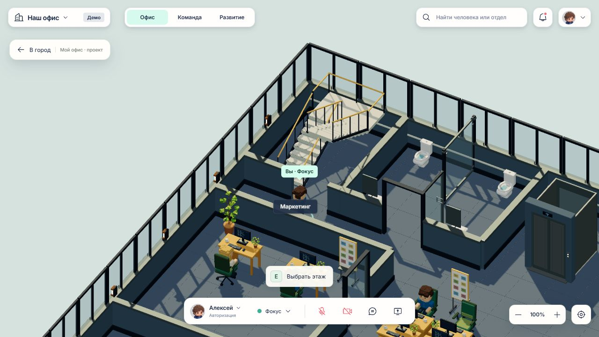
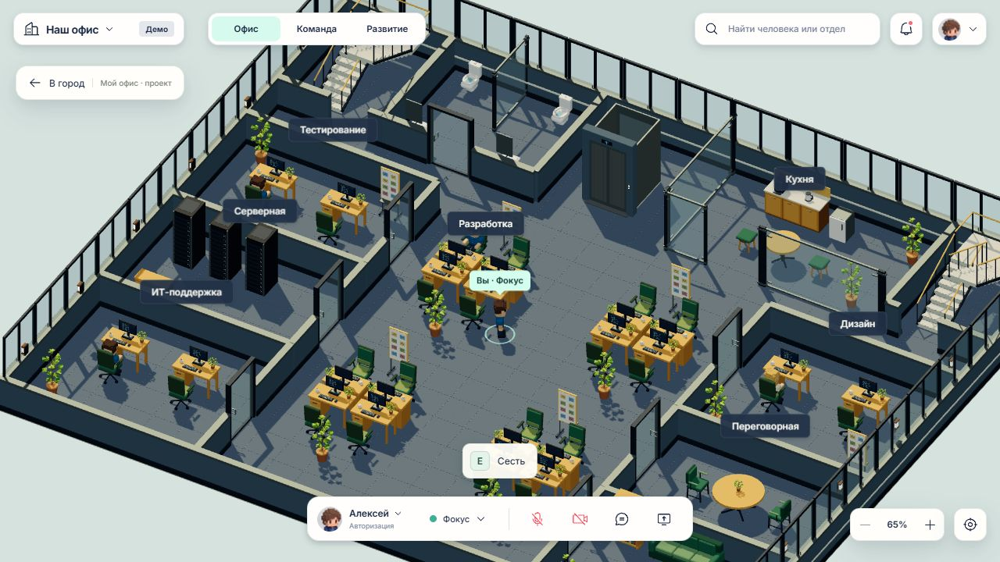
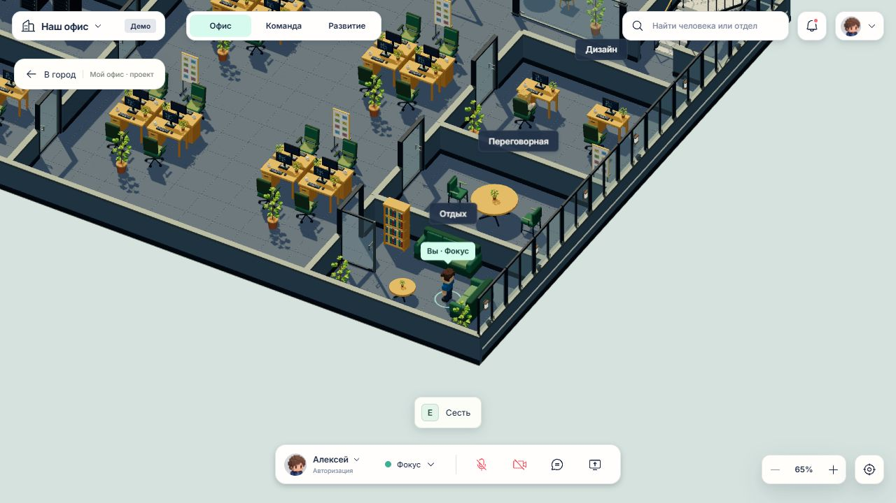
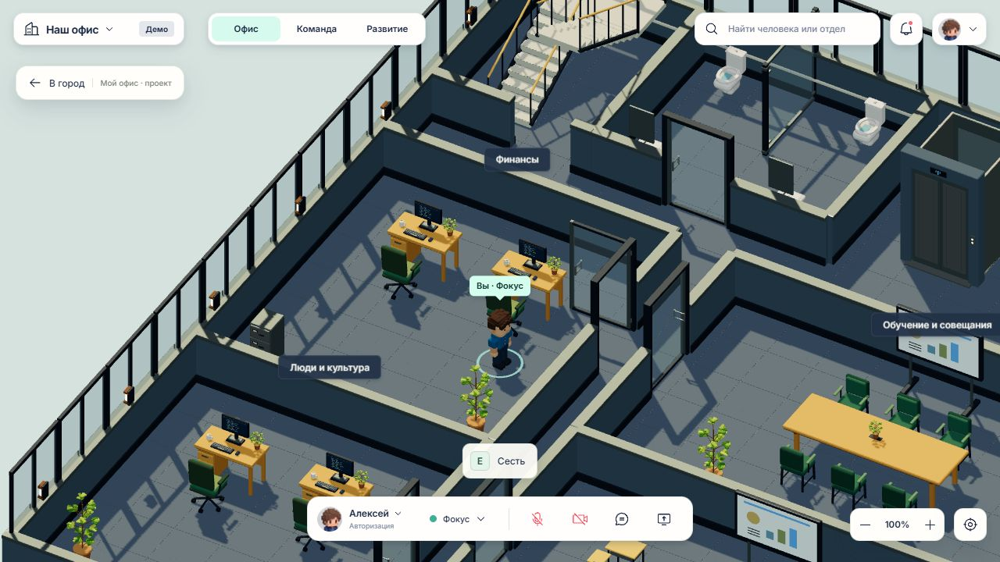
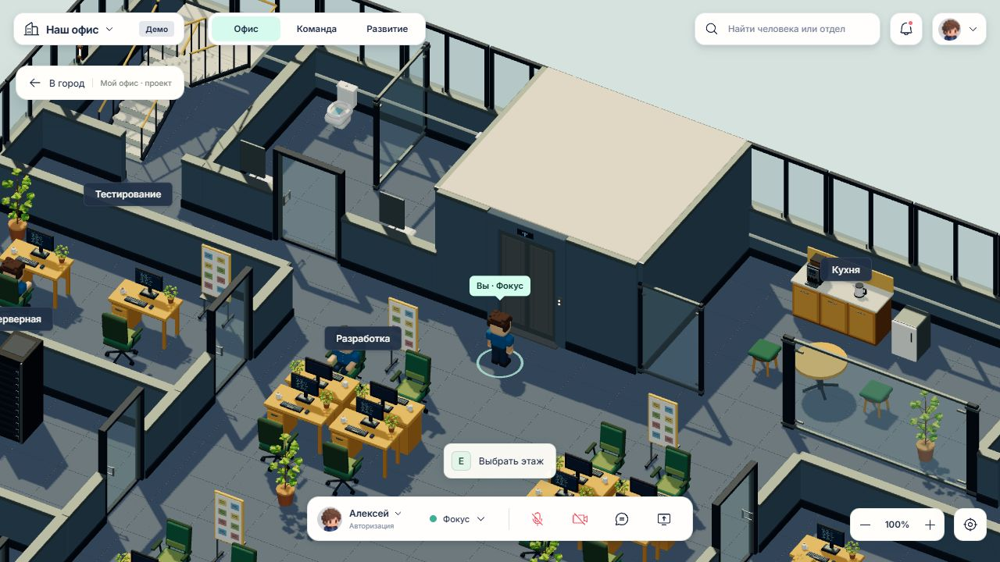

# Проверка расстановки офиса — 2026-09-29

Область: четырёхэтажный офис внутри `city-demo` (`?place=office`). Исходный `office-demo` и незавершённые изменения других задач не изменены. Работа выполнена в отдельной ветке `codex/office-layout-audit`, основанной на сохранённой версии `origin/master`.

## Исправленные проблемы

| Проблема | Исправление |
|---|---|
| Площадки лестниц выступали за заднюю стену на всех четырёх этажах | Учтён смещённый origin GLB; лестницы сдвинуты и немного уменьшены по глубине |
| Условные границы кресел, диванов и асимметричных моделей расходились с видимой геометрией | Коллизии используют реальные загруженные GLB-границы, поворот и масштаб; явные упрощённые коллизии сохраняются для горшков и конструктивных элементов |
| Створка санузла в открытом состоянии перекрывала коридор к левой лестнице | Дверь открывается внутрь санузла |
| Открытые двери пересекали столы ИТ-поддержки и финансового отдела | Ближайшие столы отодвинуты от створок |
| Коллизия открытой двери не совпадала с петлёй и ручками GLB | Заданы и проверены реальные размеры открытой створки |
| Один кухонный стул на каждом этаже не имел непрерывного подхода для посадки | Стол и оба стула расставлены с проходом снаружи группы |
| Реальные габариты диванов создавали узкое место в комнатах отдыха | Изменены расстояния между диванами, столиком, шкафом и дверью |
| Доски в рабочих группах смотрели в спинки кресел; доска в дизайне — к перегородке | Развёрнуты к свободным подходам |
| Часть шкафов, кресло онбординга и сантехника были обращены к стенам | Развёрнуты внутрь помещений; зеркала и информационные таблички привязаны к стенам |
| Перед экраном малой переговорной не было свободного подхода | Экран размещён сбоку и обращён к столу |

## Объём автоматической проверки

- 4 этажа, 2828 экземпляров объектов, 26 внутренних дверей.
- 121 посадочное место, включая занятые сотрудниками; 111 мест с взаимодействием «Сесть».
- Все размещённые GLB находятся внутри горизонтальной границы этажа.
- Наземная мебель не пересекает другую мебель, стены или полностью открытые створки. Стыки архитектурных модулей намеренно разрешены.
- Обе стороны каждого дверного проёма, лифты и обе лестницы достижимы при открытых дверях.
- Для каждого места проверяется один и тот же непрерывный путь: лифт → свободная точка подхода → собственное кресло. Шаги по найденному пути проверяются через тот же алгоритм движения, который использует приложение.
- Шкафы, серверные стойки, доски, экраны и сервисная мебель имеют доступ с лицевой стороны.
- Кресла/сидящие сотрудники обращены к своим столам, мониторы — к рабочим креслам.
- Сохранён прямой проход вход → ресепшен; наружная входная дверь есть только на первом этаже.

`npm test`: 74/74. `npm run build`: успешно. Предупреждение Vite о крупном общем Three.js-чанке сохраняется.

## Границы проверки

Это проверка игровой геометрии и маршрутов персонажа радиусом 0,25 м, а не проверка строительных норм. Лифт и лестницы по-прежнему открывают выбор этажа; физический подъём по ступеням не добавлялся. Выполнена проверка закрытого/полностью открытого положения дверей, без сертификации каждого промежуточного угла анимации.

## Проверка в браузере

Проверяемая версия запущена отдельно на `http://127.0.0.1:4197/?place=office`.

- Первый этаж: персонаж прошёл от входа к ресепшену, клавиша E открыла карту компании.
- Второй этаж: дверь санузла открыта внутрь; персонаж прошёл дальше по коридору к левой лестнице и открыл выбор этажа. Подтверждённая точка: x=-9,440; z=-5,092.
- Третий этаж: проход между рабочими группами, посадка в кресло, выход и движение D. Открыта комната отдыха, персонаж прошёл к обоим диванам; посадка на ранее недоступный боковой диван и выход успешны (точка подхода x=9,488; z=7,644).
- Четвёртый этаж: проход по западному коридору, открытие финансового отдела, вход к рабочим местам (x=-7,132; z=-0,192). Створка не задевает отодвинутый стол.
- Отсутствующие модели: 0; ошибок JavaScript в проверенной вкладке: 0.

## Исправление лифта — 2026-10-01

По скриншоту пользователя: кабина стояла отдельно от перегородок, за ней оставался проход, сверху была видна открытая шахта.

- На всех четырёх этажах портал вынесен на линию служебного коридора, а открытая передняя грань кабины состыкована с ним.
- Шахта встроена в блок между санузлом и кухней: добавлены стены и перекрытие; стекло со стороны кухни заменено глухой стеной.
- Закрытый портал имеет коллизию. Точка вызова находится перед дверями, а проход внутрь или за шахту недоступен.
- Проверки реальных GLB-границ дополнены проверкой стыка кабины/портала, покрытия шахты, недоступности её тыла и свободного коридора с обеих сторон.

Проверено в браузере на `http://127.0.0.1:4197/?place=office`:

- Второй этаж: подход слева до x=-4,005; z=-5,041.
- Клавиша E у лифта открыла выбор этажа; переход со второго на третий завершился перед дверями (x=-1,350; z=-4,700), где снова доступен вызов лифта.
- Третий этаж: проход вправо к кухне (x=1,588; z=-5,062) и обратно перед всей шахтой к санузлу (x=-3,982; z=-5,087).
- Ошибки JavaScript: 0; отсутствующие модели: 0.

`npm test`: 76/76. `npm run build`: успешно, с прежним предупреждением о размере общего Three.js-чанка. Физическая поездка внутри кабины не добавлялась: лифт сохраняет выбор этажа через E.

