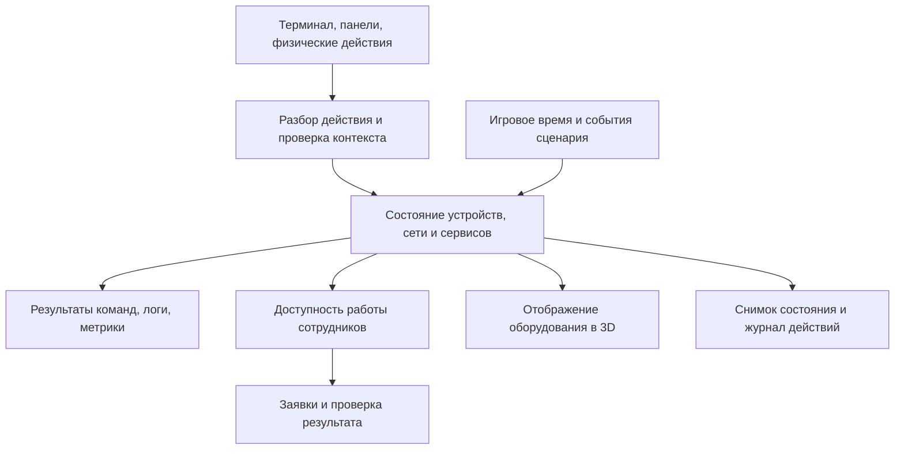

# Симулятор IT-профессий в компании — проект для обсуждения

Дата: 27 сентября 2026 года. Статус: концепция и архитектурное предложение. Игровые механики ниже ещё не реализованы. Документ не является поручением заменить работающий офис или публиковать новую версию.

**Подтверждённые решения пользователя.** Реалистичный симулятор на основе существующего 3D-офиса. Windows на рабочих местах, Linux на серверах. Требования к опыту игрока зависят от выбранной сложности. Уточнение от 27 сентября: интересуют также сетевой инженер, специалист по информационной безопасности и другие IT-роли.

**Расширение замысла.** Разделы ниже первоначально написаны для работы системного администратора и остаются предложением первого технического среза. Они не задают окончательную границу игры. Предлагается общая инфраструктура компании с различными зонами ответственности, инструментами и задачами; перечень профессий и порядок реализации ещё не согласованы. Исследование аналогов: [alternatives.md](alternatives.md).

Брейншторм задач, свободы действий, профессий, графики и камеры: [brainstorm.md](brainstorm.md). Документ сравнивает варианты и предлагает дальнейшие решения; он не заменяет утверждённые пользователем настройки действующего офиса.

**Предлагаемая исходная рамка.** Одиночная кампания в браузере, клавиатура и мышь, вымышленная компания примерно на 30 сотрудников. Игра начинается с принятия существующей инфраструктуры. Игрок отвечает за доступность рабочих инструментов, обслуживание, изменения и развитие IT. Совместный режим и настоящие виртуальные машины — отдельные будущие решения.

**Что уже есть в проекте.** Четыре этажа, ходьба, камера, коллизии, двери, лифт, посадка, сотрудники, интерфейс отделов и каталог GLB. По текущему WORLD.md основной адрес `/` уже открывает 3D-офис; `?view=3d` совместим с ним. Инфраструктура, состояния сервисов, инциденты и сохранения ещё не реализованы. Повторяющаяся проблема клавиши D остаётся отдельной проверкой перед игровым тестированием: имитация нажатий не подтверждает исправление в браузере пользователя.

**Главный принцип реализма.** Каждая неисправность имеет причину в состоянии мира. Диагностические команды, панели оборудования, логи, мониторинг и жалобы сотрудников читают одну модель. Изменение конфигурации меняет доступность сервисов и работу людей. Сценарий не проверяет, ввёл ли игрок заранее угаданную строку, и не требует единственного порядка действий.

Пример: компьютер включён, Ethernet-порт поднят и шлюз доступен, но DNS-сервер в настройках неверный. Доступ по имени может не работать, хотя часть соединений по IP остаётся доступной. У разных сотрудников симптомы могут отличаться из-за аренды DHCP, кэша и используемых приложений. Успешный ping сам по себе не доказывает исправность приложения; отсутствие ответа не всегда доказывает отсутствие сети.

**Граница между реализмом и полной ОС.** Для первой версии предлагается собственная модель инфраструктуры с точным поведением выбранных функций. Полноценные Windows, PowerShell, Linux и произвольные программы не обещаются. Для каждой поддержанной команды документируются ключи, контекст и ограничения. Неподдерживаемый синтаксис обозначается как ограничение симулятора, без выдуманного успешного результата. Переход к настоящим Linux-лабораториям потребует отдельного решения об изоляции, ресурсах и хостинге.

**Рабочий день.** Проверить состояние систем и очередь заявок → определить масштаб и приоритет → собрать факты → сформулировать и проверить гипотезу → выполнить изменение → проверить работу с точки зрения пользователя → оформить решение и профилактику. Помимо аварий есть обслуживание, выдача доступа, ввод оборудования и проекты улучшения.

День кампании можно сжимать до игровой сессии, но длительности команд и операций должны быть внутренне согласованы. Для первой проверки предлагается сессия на 20–30 минут; это гипотеза для тестирования, не оценка срока разработки. Пауза и ускорение времени настраиваются отдельно от технической сложности. Во время чтения терминала обычный ход времени остаётся предсказуемым, игрок явно видит часы. В одиночной игре скрытая вкладка и выход приостанавливают мир; возвращение не создаёт несыгранные часы аварий.

**Сложность.** Базовые сетевые и системные правила одинаковы на всех уровнях. Сложность меняет наблюдаемость, полноту документации, сочетания неисправностей и условия работы.

| Режим | Информация и помощь | Нагрузка и последствия |
| --- | --- | --- |
| Обучение | Актуальная схема, пояснения терминов, ступенчатые подсказки, разобранный первый случай | Одна основная причина, удобная пауза, восстановление из контрольной точки |
| Работа | Часть документации устарела, подсказки по запросу | Несколько обращений, сроки, ограниченные запасные части, необходимость планировать изменения |
| Эксперт | Неполная инвентаризация, ограниченные права и наблюдение, подсказки отключены по выбору | Несколько связанных причин, последствия прошлых решений, обслуживание под нагрузкой |

Частота аварий, подсказки, пауза и откат доступны как отдельные настройки. Экспертный режим не создаёт неразрешимых загадок: у каждого случая есть доступный способ получить доказательства и восстановить работоспособность либо обоснованно эскалировать проблему. Известные игроку команды не блокируются уровнем персонажа.

**Роль пространства.** Физический визит нужен для осмотра кабеля, питания, индикации, замены детали, подключения консоли и разговора. Если сеть и права позволяют, работу можно выполнить удалённо с ноутбука. Игрок не должен идти через четыре этажа ради каждой команды.

| Этаж | Игровое назначение |
| --- | --- |
| 1 | Гостевая сеть, ресепшен, переговорные и оборудование презентаций |
| 2 | Рабочие станции, принтеры, бизнес-приложения и отделы с разными зависимостями |
| 3 | Серверная, коммутация, Linux-сервисы, рабочее место администратора, склад |
| 4 | Согласование бюджета и обслуживания, руководство, обучение, отчёты |

Начальная игра использует рабочую зону и серверную на существующих этажах. Остальные помещения не требуют одновременно наполнения заданиями. Номер этажа не служит уровнем сложности. У стола, настенной розетки, порта и сервера есть отдельные стабильные идентификаторы; кабели связывают конкретные порты. Внешний вид GLB отделён от функции устройства.

**Что симулируется.** Строим систему по слоям, вводя только проверяемые зависимости.

| Система | Состояние и действия | Этап |
| --- | --- | --- |
| Оборудование | Питание, сетевой адаптер, порты, физические соединения, включение и загрузка | Первая версия |
| IP-сеть | Адрес, маска, шлюз, доступность маршрута, конфликты адресов | Первая версия |
| DNS и DHCP | Настройки выдачи, аренды, записи, кэш и срок действия | Первая версия |
| Linux-сервис | Состояние процесса, конфигурация, слушающий порт, журналы, зависимости | Первая версия |
| Доступ | Игровые учётные записи, контекст сеанса, базовое повышение прав | Первая версия |
| Заявки | Затронутые пользователи, влияние, состояние, проверка, повторное открытие | Первая версия |
| VLAN и фильтрация | Членство портов, разрешённые пути, правила протокол/порт, доступ для управления | Следующий этап |
| Файлы и права | Файловые ресурсы, группы, ACL, блокировки, квоты | Следующий этап |
| Диски и копии | Заполнение, задания резервирования, срок последней копии, восстановление и проверка | Следующий этап |
| Wi-Fi и VPN | Подключение, сегмент сети, качество связи, удалённый доступ | Следующий этап |
| Виртуализация и питание | Хосты и гости, ресурсные ограничения, UPS, последовательность восстановления | Позднее |
| Доменная инфраструктура | Расширенная модель каталога, политик и доверия; глубина совместимости обсуждается отдельно | Позднее |
| Автоматизация | Небольшие поддержанные сценарии, проверки и расписания, воспроизводимые изменения | После устойчивого ядра |

В первой версии модель сети рассчитывает доступность по состоянию соединений, адресов и сервисов. Полная симуляция каждого Ethernet-кадра или пакета не нужна для выбранных задач. Если позднее появится анализатор трафика, он должен показывать трассы запросов этой же модели, а не несвязанные декоративные записи.

**Инструменты игрока.** Ноутбук открывается в полноценную рабочую панель: заявки, терминал, схема сети, инвентаризация, документация, журнал изменений и мониторинг. В панели всегда видны текущий хост, пользователь и способ подключения. Локальная консоль доступна рядом с устройством, удалённое подключение требует работающего пути и прав. В начале инвентаризация может быть неполной; обнаруженные факты постепенно дополняют её.

Для первого вертикального среза достаточно ограниченного набора Windows-команд (`ipconfig`, `ping`, `nslookup`, выбранные параметры `Test-NetConnection`) и Linux-команд (`ip addr`, `ip route`, `ping`, `ss`, выбранные операции `systemctl` и `journalctl`). Список и флаги уточняются при проектировании конкретного сценария; это не обещание поддержки целиком. Менять конфигурацию в начале можно через игровые редакторы и панели. Позднее добавляются расширенные оболочки, редактирование файлов и автоматизация.

У терминала должны работать история, копирование, выделение, прерывание поддержанных длительных операций и предсказуемый фокус. Пока игрок печатает, WASD не двигает персонажа; Escape сначала закрывает активный инструмент. Ошибка команды имеет понятный тип: неверный аргумент, недостаточно прав, недоступный хост или функция вне текущей модели.

**Наблюдаемость и неопределённость.** Мониторинг получает сведения только от доступных проверок и агентов. Потеря связи с датчиком означает «данные недоступны», а не подтверждённую поломку. Метрики содержат время последнего обновления. Просмотр карты не раскрывает автоматически корень неисправности. Диагностика учитывает исходный хост, пользователя, время, кэш и состояние служб.

**Сотрудники и заявки.** Сотрудник описывает симптом в рамках своей работы: «CRM не открывается», «не могу сохранить отчёт». Игрок уточняет время, масштаб, последние изменения и затронутое приложение. Один сетевой сбой может породить несколько обращений; их можно связать с одним инцидентом. Приоритет зависит от влияния на деятельность и срочности, а не только от должности заявителя.

Обращение проходит состояния: новое, принято, диагностика, ожидание, восстановление, проверка, закрыто. Ожидание поставки или согласования фиксируется отдельно от времени активной работы. Решение проверяется попыткой сотрудника выполнить исходную операцию. Заявка может открыться повторно, если причина осталась. Система принимает альтернативные корректные решения, отмечая временные обходы и долгосрочные исправления.

**Сценарии.** Каждый случай задаёт начальное состояние, изменение-причину, доступные признаки, условия проверки и ожидаемые последствия. Жалоба не содержит скрытую подсказку с точным диагнозом. Случайность использует сохранённое зерно: повторное прохождение можно воспроизвести. Варианты меняют значимые параметры и иногда причину, а не только имена сотрудников.

В первый набор предлагаются три семейства: физическое отключение рабочего места; неправильная выдача DNS через DHCP; недоступность Linux-приложения из-за состояния сервиса. Дополнительные семейства: конфликт IP, ошибка VLAN, блокировка порта, истёкший сертификат, заполненный диск, недоступный файловый ресурс, сорванная резервная копия. Причины вводятся постепенно, а не случайно все сразу.

**Подробный пример: «После переезда не открывается CRM».** У части рабочих мест после обновления аренды выдан адрес старого DNS-сервера. Шлюз доступен, основной сервис CRM исправен. Старые клиенты ещё используют прежние настройки или кэш, поэтому не все жалуются одновременно. Источник проблемы — конфигурация DHCP, изменённая при переезде.

Игрок сравнивает сетевые параметры работающего и проблемного ПК, проверяет разрешение имени, проверяет доступность нужного сервиса и смотрит выдаваемые DHCP-параметры. Можно временно назначить правильный DNS одному клиенту: это помогает этому человеку, но не исправляет выдачу остальным. Устойчивое решение меняет источник неверной конфигурации, учитывает обновление аренд и проверяет доступ с нескольких рабочих мест. Перезапуск CRM не должен устранять неправильную DNS-настройку. Такая логика опирается на реальные категории диагностики Windows, но конкретный случай является нашим игровым сценарием.

**Первый рабочий день.** Предлагаемая последовательность для испытания игры: знакомство с оборудованием и заявкой → локальный физический сбой → несколько связанных жалоб на имена внутренних сервисов → проверка Linux-приложения → краткий отчёт с оставшимися рисками. В первой сессии одновременно развивается одна основная причинная цепочка. Переход к следующему событию учитывает состояние мира, чтобы не ломать ещё не освоенную систему и не создавать противоречащие друг другу подсказки.

**Цена действий.** Отключение коммутатора влияет на все зависимые узлы. Перезапуск сервиса прерывает связанные операции на время запуска. Изменение конфигурации может отрезать удалённый доступ; тогда понадобится физическая консоль. Работа оценивается по восстановленным пользовательским операциям, масштабу простоя, устойчивости исправления и качеству передачи информации. Проверка, что новый сбой не появился у другого отдела, входит в результат.

У безопасного изменения есть просмотр затронутых систем, возможность сохранить предыдущую конфигурацию и заранее описанный откат. Снимок настройки, резервная копия данных и восстановление сервиса — разные механики. Жёсткие последствия не возникают без наблюдаемых причин. Игра объясняет итоги через временную шкалу: что поменял игрок, какие зависимости затронуты и почему пришли новые заявки.

**Развитие и экономика.** Направления навыков: рабочие места, сеть, Linux, доступ, резервирование, наблюдение, автоматизация, коммуникация. Повышение требует подтверждённых действий и устойчивых результатов. Формат карьерной лестницы из офиса можно переиспользовать как личное дело игрока. Умения не дают магический бонус к правильности команд; они открывают ответственность, инструменты, бюджет и новые проекты. Нельзя зарабатывать бесконечный опыт, намеренно создавая и устраняя одну неисправность.

Бюджет компании отделён от зарплаты персонажа. Запчасти, сроки поставки, запасные устройства и улучшения инфраструктуры формируют выбор. В первом прототипе достаточно ограниченного склада и одного решения об улучшении; полноценная закупка, ассортимент и финансовая симуляция откладываются. Хорошая профилактика уменьшает повторные аварии и освобождает время для проектов. Проекты развития обеспечивают интерес и после стабилизации сети; надёжную работу не нужно наказывать искусственной бесконечной чередой поломок.

**Интерфейс и подача.** Сохранить текущий дневной 3D-стиль и камеру. На игровом HUD показать время, активную заявку, краткие уведомления и контекстное действие. Техническая работа разворачивается в панели ноутбука с читаемым текстом, вкладками и сравнением данных. Отдельный обзор оборудования нужен для портов и кабелей. Полноценные копии Windows Desktop и десятков системных окон в первый этап не входят.

Мир и пояснения — на русском, имена команд и технических идентификаторов сохраняют принятую форму. Цвет дополняется значком и текстом. Доступны переназначение клавиш, масштаб интерфейса, отключение движения камеры при необходимости, управление маршрутом мышью. Цель первой версии — настольный браузер; планшет и телефон требуют отдельной проверки управления.

**Техническая схема — предложение.** Сохранить React и Three.js, новое ядро симуляции писать отдельным модулем TypeScript. Рендер не определяет сетевую исправность. Состояние всех этажей существует независимо от того, какой этаж виден.

Ядро получает явные действия и виртуальное время, проверяет права и доступ, применяет изменения, затем рассчитывает последствия. Оно не использует DOM или Three.js и тестируется без браузерной сцены. UI и терминал отправляют одинаковые действия; нельзя исправить устройство в GUI, оставив противоречащее состояние в консоли. События имеют последовательный номер; повторная доставка действия не дублирует покупку или изменение.

Предлагаемые сущности: Device, Interface, Port, Link, Network, Lease, DnsRecord, Service, File, Principal, Session, Incident, Ticket, EmployeeActivity, ScheduledEvent, ChangeRecord. Каждая игровая машина хранит собственную конфигурацию. Общий шаблон модели компьютера или GLB не является общим состоянием всех экземпляров. Симуляция исполняет события в определённом порядке; одинаковые стартовое состояние, зерно и действия дают одинаковый результат.

Основные файлы нового модуля можно организовать в `src/sim/core`, `src/sim/network`, `src/sim/systems`, `src/sim/commands`, `src/sim/scenarios`, `src/sim/persistence`. Это предлагаемое размещение; папки пока не созданы. `world/officeWorld.js` остаётся ответственным за представление и взаимодействия, а его объекты связываются с устройствами через стабильный `deviceId`. Новые метаданные функций оборудования не надо зашивать в GLB.

Для UI терминала подходит xterm.js, но он предоставляет отображение терминала, а не Windows или Linux. Парсер команд и поведение устройств реализуем отдельно. Команды не запускаются в ОС игрока, не обращаются к его локальной сети и не передаются в JavaScript eval. Все адреса, файлы, подключения и учётные записи относятся к игровому миру. Внешняя сеть для технической симуляции не требуется.

Симуляцию можно выполнять в браузерном Web Worker, чтобы не блокировать интерфейс. Это отдельный механизм браузера, не сервис Cloudflare Workers. Cloudflare Pages раздаёт приложение; для первой одиночной версии сервер симуляции не требуется. Работу без интернета после первой загрузки нужно отдельно реализовать через кеширование ресурсов, она не появляется автоматически от локальной симуляции.

**Сохранения.** IndexedDB хранит согласованный снимок мира, игровое время, очередь событий, зерно, прогресс и версию схемы. Сохранение атомарно; восстановление не повторяет уже завершённые события. Предлагаются несколько слотов, автосохранение после значимых действий и в устойчивых точках, ручной экспорт/импорт файла. Смена домена и очистка браузера не должны терять единственную копию прогресса: экспорт предусмотрен с первой версии. При открытии второго окна одного сохранения нужен один ведущий экземпляр либо режим только чтения, чтобы окна не перезаписывали друг друга.

Сохранения в браузере привязаны к origin; перенос с workers.dev на pages.dev сам по себе их не переносит. Облачная синхронизация — следующий этап с авторизацией и разрешением конфликтов. Локальное хранение само по себе не даёт защиту от изменения прогресса, поэтому рейтинги с доверием к результатам потребуют серверной проверки.

**Совместный режим — перспектива.** Если он понадобится, сервер становится источником состояния компании и проверяет действия игроков. Клиенты получают изменения через WebSocket; разные администраторы могут работать с одной инфраструктурой, поэтому нужны блокировки или версии конфигураций, роли и общий журнал изменений. Cloudflare Durable Objects — возможный кандидат для координации мира с WebSocket и постоянным хранилищем; это нужно оценить по нагрузке и стоимости отдельно. Переносить синхронизацию непосредственно в Three.js не следует.

**Роль AI.** Первая версия обходится без генеративной модели. Если позже появятся свободные диалоги или помощник, они используют только известные персонажу наблюдения. Состояния сервисов, результаты команд, проверка исправления и начисление прогресса определяет ядро. Диалог не может создать несуществующий факт, выдать скрытую причину или самостоятельно выполнить изменение.

**Порядок разработки и критерии готовности.**

| Этап | Результат | Проверка перед расширением |
| --- | --- | --- |
| 1. Техническая лаборатория | Две рабочие станции, сеть, DNS/DHCP, Linux-приложение, локальный и удалённый контекст | Одни и те же причины дают согласованные симптомы во всех инструментах; альтернативные решения действительно работают |
| 2. Игровой рабочий день | Привязка к 3D, три семейства инцидентов, заявки, проверки, подсказки, сохранение | Игрок проходит день без доступа к отладочному состоянию, понимает причину и последствия |
| 3. Повторяемость | Несколько причин и начальных условий, уровни сложности, профилактика, разбор дня | Незнакомый вариант решается диагностикой; повторное прохождение не требует угадывать сценарий |
| 4. Кампания | Проекты, деньги, навыки, склад, новые этажи и системы | Развитие меняет работу компании и создаёт осмысленный выбор |
| 5. Дополнительные режимы | Кооператив или настоящие лаборатории, если подтверждён спрос | Отдельное архитектурное и бюджетное решение |

Не начинать с реалистичной визуализации каждого кабеля, десятков оболочек, полного Active Directory, Kubernetes и многопользовательской экономики одновременно. Главная проверка — удовольствие от достоверной диагностики одного законченного случая. Библиотека из 87 GLB позволяет обойтись небольшим количеством новых моделей: обслуживаемый сервер/коммутатор с портами, ноутбук администратора, настенные сетевые розетки, кабели и инструмент. Точные потребности определяются после лаборатории.

**Как проверять качество.** Нужны содержательные проверки причин и последствий: отключение общего узла влияет на всех зависимых клиентов; смена DNS не чинит оборванный кабель; истечение кэша и аренды учитывает игровое время; перезагрузка не лечит неизменённую неверную конфигурацию; недостаток прав блокирует изменение; сохранение/загрузка сохраняет результат диагностики. Для каждой семьи инцидентов проверяются хотя бы один постоянный ремонт, временный обход и правдоподобное неверное действие.

Браузерная проверка дополнительно покрывает фокус терминала, D/В и стрелки в реальной раскладке пользователя, взаимодействия в пределах доступности, загрузку моделей, читаемость и возвращение из фоновой вкладки. Производительность измеряется на выбранном тестовом ноутбуке; бюджет симуляции и число устройств устанавливаются по замерам, а не обещанием фиксированного FPS заранее.

Два типа игрового тестирования: начинающий должен связать объяснение с наблюдаемым результатом, опытный администратор должен пройти случай своим корректным методом. Собираем добровольный отзыв о понятности, скучных перемещениях и ложных подсказках. Автоматическая телеметрия не входит в начальный объём.

**Вопросы следующего обсуждения.** Подтвердить границу собственного симулятора и настоящих ОС; выбрать главный сценарий первого рабочего дня; решить, играем за единственного администратора или младшего специалиста с наставником. После этого стоит детально расписать один инцидент, его состояния, поддержанные команды и экраны. Эти решения важнее раннего выбора названия, монетизации или количества этажей кампании.

**Технические источники.** Концепт, игровые системы и порядок разработки выше — наши предложения. Справочники ниже используются для поведения команд и возможностей платформы, а не как готовый дизайн игры.

- [Microsoft: диагностика DNS-клиентов Windows](https://learn.microsoft.com/windows-server/networking/dns/troubleshoot/troubleshoot-dns-client).
- [Microsoft: Test-NetConnection](https://learn.microsoft.com/en-us/powershell/module/nettcpip/test-netconnection?view=windowsserver2025-ps).
- [xterm.js: терминальный интерфейс в браузере](https://xtermjs.org/).
- [MDN: Web Workers](https://developer.mozilla.org/en-US/docs/Web/API/Web_Workers_API/Using_web_workers).
- [MDN: IndexedDB и ограничение по origin](https://developer.mozilla.org/en-US/docs/Web/API/IndexedDB_API).
- [Cloudflare: WebSocket в Durable Objects](https://developers.cloudflare.com/durable-objects/best-practices/websockets/).
- [Cloudflare: постоянное хранилище Durable Objects](https://developers.cloudflare.com/durable-objects/best-practices/access-durable-objects-storage/).
